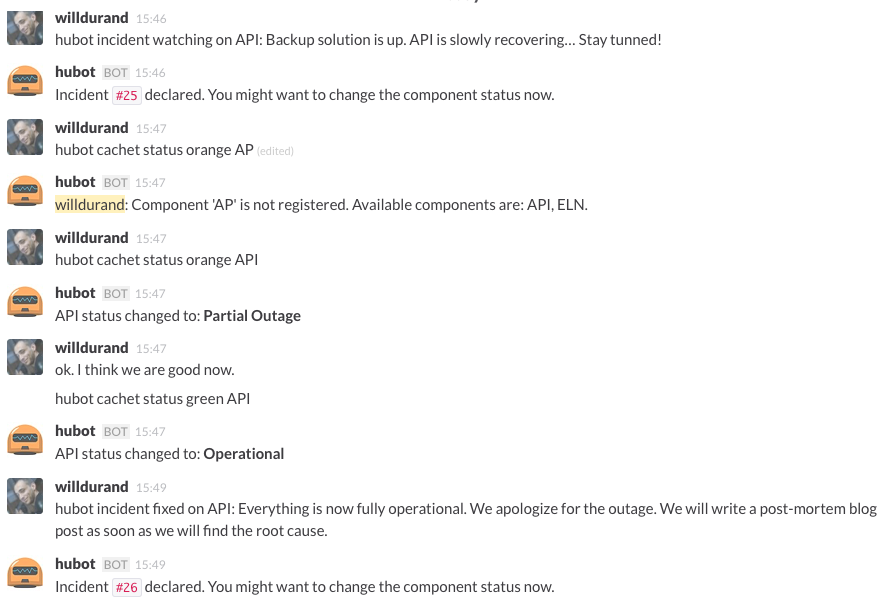

hubot-cachet
============

[](https://travis-ci.org/willdurand/hubot-cachet)

A hubot script to manage incidents/statuses with [Cachet](https://cachethq.io).

See [`src/cachet.coffee`](src/cachet.coffee) for full documentation.

Installation
------------

In hubot project repo, run:

    npm install hubot-cachethq --save

Then add **hubot-cachethq** to your `external-scripts.json`:

```json
[
    "hubot-cachethq"
]
```

Usage
-----

Most of the commands are available under the `cachet` namespace:

```
hubot help cachet
```

For simplicity purpose, incidents are managed with this namespace:

```
hubot help incident
```

### Screenshots




License
-------

hubot-cachet is released under the MIT License. See the bundled LICENSE file for
details.
